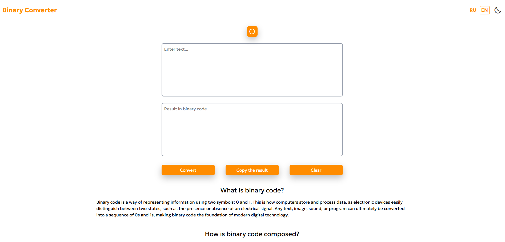
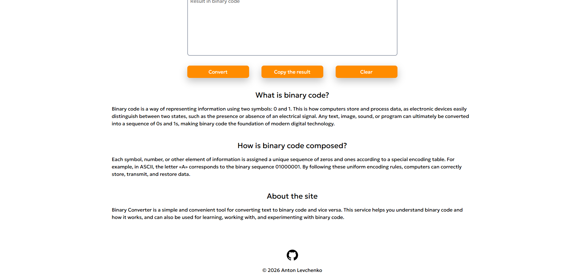
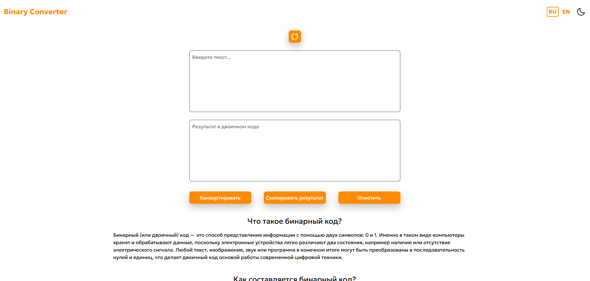
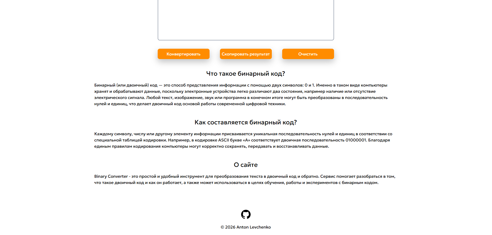

# Binary Converter

### [EN]

<div align="center">
   <br>
  
</div>

### About the Project

Binary Converter is a tool for converting text to binary code and vice versa, using the Encoding API.

### Features

* Text to binary conversion
* Binary to text conversion
* In addition to plain text, the Encoding API converts text in all languages ​​(UTF-8) and any emoji to binary code
* Support for RU and EN languages ​​on the website

### Technology Stack

* HTML5
* Tailwind CSS (v4)
* JavaScript

### Installation and Run

```
git clone https://github.com/antlevchenko/binary-converter.git
cd binary-converter
npm install
npm run tailwind-watch
```

Then open the index.html file in your browser (manually or via Live Server).

### Project Website

[Netlify](binary-converter-app.netlify.app)

### [RU]

<div align="center">
   <br>
  
</div>

### О проекте

Binary Converter - это инструмент для преобразования текста в двоичный код и наоборот, использующий Encoding API.

### Возможности

* Преобразование текста в двоичный код
* Преобразование двоичного кода в текст
* Помимо обычного текста, Encoding API преобразует текст на всех языках (UTF-8) и любые эмодзи в двоичный код
* Поддержка RU и EN языков на сайте

### Стек технологий

* HTML5
* Tailwind CSS (v4)
* JavaScript

### Установка и запуск

```
git clone https://github.com/antlevchenko/binary-converter.git
cd binary-converter
npm install
npm run tailwind-watch
```

После откройте файл index.html в вашем браузере (вручную или через Live Server).

### Сайт проекта

[Netlify](binary-converter-app.netlify.app)
